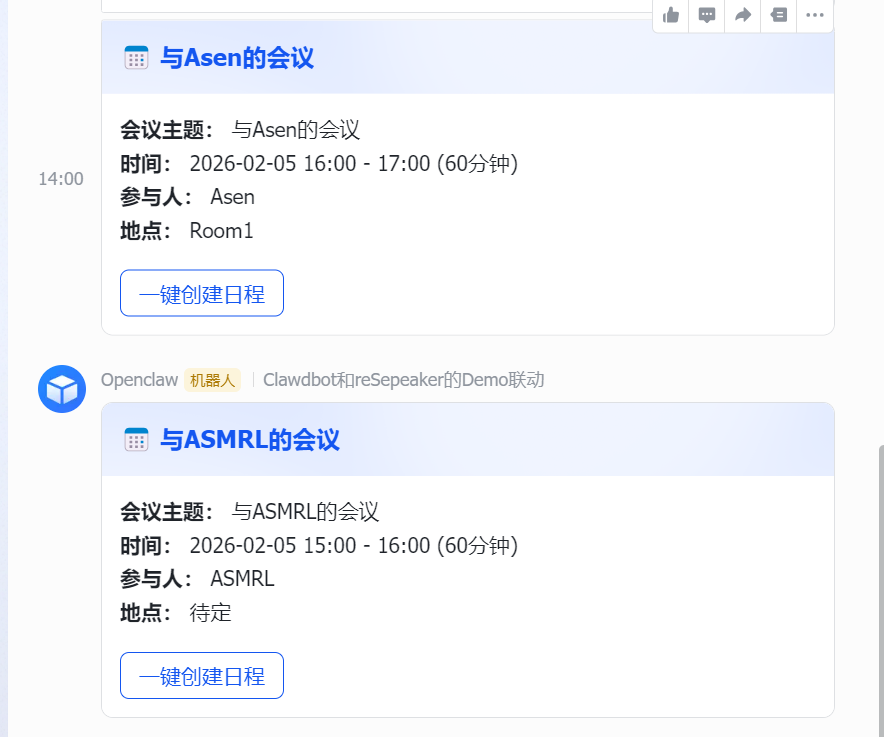

# 飞书互动式会议卡片项目

## 项目概述

这是一个结合语音识别、自然语言处理和飞书API的创新项目，实现了通过语音输入自动创建并发送互动式会议邀请卡片到飞书群组的功能。

### 核心功能
1. **语音识别** - 使用ReSpeaker硬件 + Whisper模型进行英文语音识别
2. **自然语言理解** - 解析语音中的会议信息（时间、参与者、地点等）
3. **互动式卡片生成** - 创建包含会议详情和一键创建日程按钮的飞书卡片
4. **群组发送** - 将卡片发送到指定的飞书群组

## 技术架构

### 主要组件
```
项目结构:
├── Demo.py              # 主程序入口
├── asr_english.py       # 语音识别模块
├── feishu_meeting/      # OpenClaw Skill模块
│   ├── send_meeting_card.py
│   └── SKILL.md
├── requirements.txt     # 依赖列表
└── README.md           # 项目文档
```

### 技术栈
- **语音识别**: Whisper Tiny English + sherpa-onnx
- **语言处理**: 本地规则解析 + Moonshot AI (备用)
- **消息发送**: 飞书API + OpenClac Skill系统
- **硬件**: ReSpeaker 4-Mic Array

## 功能详解

### 1. 语音输入处理
```python
# 示例语音输入
"Schedule a meeting with Tom tomorrow at 3pm in Room 1"

# 系统解析结果:
{
    "topic": "Meeting",
    "date": "2024-01-15",
    "time": "15:00",
    "attendees": ["Tom"],
    "location": "Room 1",
    "duration": 60
}
```

### 2. 互动式卡片特性
- **会议详情展示**: 主题、时间、地点、参与者
- **一键创建日程**: 点击按钮直接在飞书日历创建事件
- **响应式设计**: 适配不同设备屏幕
- **实时反馈**: 发送状态实时回传

### 3. 多语言支持
- **主要**: 英文语音识别
- **辅助**: 中英文混合解析
- **扩展**: 支持其他语言模型接入

## 部署指南

### 环境要求
```bash
# 系统要求
- Ubuntu 18.04+ / Debian 10+
- Python 3.8+
- Node.js 16+
- ReSpeaker驱动

# 硬件要求
- ReSpeaker 4-Mic Array
- 2GB+ RAM
- 网络连接
```

### 安装步骤

#### 1. 安装OpenClaw
```bash
npm install -g openclaw
openclaw init
```

#### 2. 配置飞书应用
```bash
# 创建飞书应用
# 获取以下信息:
- App ID
- App Secret  
- Verification Token
- Encrypt Key

# 配置OpenClaw认证
~/.openclaw/agents/main/agent/auth-profiles.json
```

#### 3. 安装Python依赖
```bash
pip install -r requirements.txt
```

#### 4. 配置语音识别模型
```bash
# 下载Whisper模型
mkdir -p ~/moltbot/asr_model_en
cd ~/moltbot/asr_model_en

# 下载tiny.en模型文件
wget https://github.com/k2-fsa/sherpa-onnx/releases/download/asr-models/tiny.en-encoder.onnx
wget https://github.com/k2-fsa/sherpa-onnx/releases/download/asr-models/tiny.en-decoder.onnx
wget https://github.com/k2-fsa/sherpa-onnx/releases/download/asr-models/tiny.en-tokens.txt
```

### 关键配置

#### OpenClaw配置
```json
// ~/.openclaw/openclaw.json
{
  "model": {
    "default": "moonshot/kimi-k2-0905-preview",
    "moonshot": {
      "baseUrl": "https://api.moonshot.cn/v1",
      "apiKey": "your-api-key"
    }
  }
}
```

#### 飞书认证配置
```json
// ~/.openclaw/agents/main/agent/auth-profiles.json
{
  "feishu": {
    "appId": "your-app-id",
    "appSecret": "your-app-secret",
    "verificationToken": "your-token",
    "encryptKey": "your-encrypt-key"
  }
}
```

## 使用说明

### 启动程序
```bash
cd ~/feishu_card
python3 Demo.py
```

### 语音指令示例
```
英文:
- "Schedule a meeting with Tom tomorrow at 3pm"
- "Book a review meeting today at 2pm in Room 1"
- "Create a discussion next Monday at 10am"

中文:
- "明天下午3点和Tom开会"
- "今天2点在会议室1开评审会"
- "下周一上午10点创建讨论会"
```

### 运行流程
1. **语音识别** - 5秒录音，Whisper模型识别
2. **信息解析** - 提取时间、人员、地点等信息
3. **卡片生成** - 创建飞书互动式会议卡片
4. **群组发送** - 发送到配置的飞书群组
5. **结果反馈** - 显示发送状态和卡片ID

## 故障排除

### 常见问题

#### 1. 语音识别失败
```bash
# 检查录音设备
arecord -l

# 测试录音
arecord -D plughw:2,0 -d 5 test.wav

# 检查模型文件
ls -la ~/moltbot/asr_model_en/
```

#### 2. 飞书API认证错误
```bash
# 检查认证配置
cat ~/.openclaw/agents/main/agent/auth-profiles.json

# 验证App权限
# 确保应用有发送消息权限
```

#### 3. 卡片发送失败
```bash
# 检查群组ID
# 验证网络连接
# 查看OpenClaw日志
openclaw gateway status
```

### 调试模式
```bash
# 启用详细日志
export OPENCLAW_DEBUG=1
python3 Demo.py

# 查看OpenClaw日志
tail -f ~/.openclaw/logs/gateway.log
```

## 扩展开发

### 新增语言支持
1. 下载对应语言的Whisper模型
2. 修改ASR配置
3. 更新解析规则

### 自定义卡片模板
1. 修改`send_meeting_card.py`
2. 调整卡片布局和样式
3. 添加新的交互元素

### 集成其他AI服务
- 支持其他大语言模型
- 集成日历服务
- 添加邮件通知

## 效果展示

### 演示视频

<video src="DemoVideo.mp4" controls width="100%"></video>

### 卡片效果截图



### 功能演示说明

视频中展示了完整的语音交互流程：

1. **语音唤醒** - 使用 ReSpeaker 麦克风阵列进行语音采集
2. **语音识别** - Whisper 模型实时识别语音指令
3. **信息提取** - 自动解析会议主题、时间、地点、参与者
4. **卡片生成** - 创建精美的飞书互动式会议卡片
5. **一键发送** - 卡片发送到指定飞书群组
6. **日程创建** - 点击卡片按钮直接在飞书日历创建事件

---

## 项目亮点

### 创新特性
1. **语音到卡片** - 完整的语音交互流程
2. **多模态融合** - 语音+AI+API的整合方案
3. **本地化部署** - 支持离线语音识别
4. **可扩展架构** - 易于添加新功能

### 技术价值
- 展示了OpenClaw Skill系统的实际应用
- 提供了语音识别的完整解决方案
- 实现了飞书API的深度集成
- 创建了可复用的技术框架

### 应用场景
- 智能会议室系统
- 语音助手开发
- 企业自动化工具
- 教育培训项目

## 开源计划

### 发布内容
- [x] 核心代码开源
- [x] 文档完善
- [ ] Docker容器化
- [ ] Web界面开发
- [ ] 多语言模型支持

### 社区贡献
欢迎提交Issue和Pull Request，共同完善项目功能。

